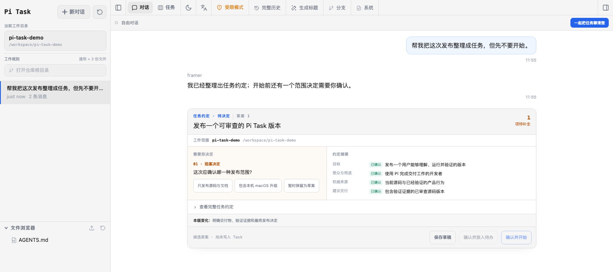

# Pi Task

[English](./README.md) · [简体中文](./README.zh-CN.md) · [Русский](./README.ru.md)

> **AI との会話を、再開・レビュー・承認できる仕事へ。**

Pi Task は [Pi](https://github.com/badlogic/pi-mono) 上に構築された、ローカルで会話中心のタスク・ワークスペースです。1 つの作業ディレクトリを選んで自然に会話し、継続的な成果が必要な仕事だけを、目標、実行履歴、検証証拠、人による承認を持つ Task に整理します。

**会話を優先 · 1 つの作業ディレクトリ · 人が重要な判断を保持 · ローカルなソース実行**



*中国語 UI の完全に隔離された架空ワークスペースです。実際の Session、Task、認証情報、ローカルパスは含みません。*

## Pi Task が解決すること

チャット履歴だけでは、成果物のある仕事に必要な問いへ明確に答えられないことがあります。

- 最終的に何を届けるのか？
- どの資料と制約が正しい基準なのか？
- 中断、ブロック、または人の判断待ちなのか？
- 何を変更し、どう検証し、何が未確認なのか？
- 仕事の完了を誰が決めるのか？

Pi Task は、別のプロジェクト管理システムを会話の前に置かず、これらの答えを元の Pi 会話に結び付けます。

```text
作業ディレクトリを選ぶ
→ 自然に会話する
→ 継続的な成果が必要ならタスク合意を保存または確認する
→ 同じ会話で実行・一時停止・判断・再開する
→ 成果物と検証証拠をレビューする
→ 承認する、または差し戻す
```

簡単な質問は、そのまま簡単な会話です。Task は、継続的な管理が役立つときだけ使います。

## 特徴

- **1 つの作業ディレクトリ：**会話、ファイル、実際に読み込まれたルールの参照元、Task Board が同じローカル範囲に従います。
- **会話から Task が生まれる：**考え始める前に Project を作成したり、長いフォームを埋めたりする必要はありません。
- **人の確認を省略しない：**選択肢のクリックは質問への回答であり、Run の開始や外部操作の許可ではありません。
- **Task と Run を分離：**Agent のストリーミング終了を業務上の完了とは扱いません。Review の承認と Task の完了は人だけが行えます。
- **途中から再開可能：**中断、ブロック、キャンセル、同一 Session での再開、成果物、Review 証拠を保持します。
- **Pi が中心：**セッション閲覧、リアルタイムチャット、モデル、Skill、ファイル、Git worktree をタスクフローの周囲で利用できます。

## ソースから起動

**必要条件：** Node.js 22.19.0 以降。

```bash
git clone https://github.com/adamhillaby266-blip/pi-task.git
cd pi-task
npm ci --include=dev --ignore-scripts
npm run dev
```

<http://127.0.0.1:30142> を開きます。

Pi Task は現在、開発者向けのソースリリースです。エンドユーザー向けインストーラーや npm パッケージではありません。上流由来の `npx`、グローバルインストール、`pi-web` コマンドは使用しないでください。隔離開発、検証、macOS ローカルビルドについては [Developing Pi Task from source](./docs/development.md) を参照してください。

## 現在の利用境界

Pi Task は開発者のローカル利用向けです。

- ソースランチャーは loopback ホスト（`127.0.0.1` または `localhost`）のみを受け入れます。
- LAN 公開、リバースプロキシ、ホスティング、Docker、npm 公開、署名済みデスクトップアプリ、自動更新、GitHub Release はサポートしません。
- Pi Web と Pi Task で同じ実行中 Pi Session を同時に操作しないでください。
- Multi-Agent は既定で有効になりません。現在の中心経路は 1 つの会話と明示的な人の判断です。

## ローカルデータとモデルのプライバシー

アプリケーションと Task の状態はローカルに保存されますが、モデルへのリクエストは Pi に設定された Provider に従います。

- Pi セッション、モデル設定、認証：`~/.pi/agent`
- Task、Run、成果物、Review、イベント：`~/.pi-task/pi-task.sqlite`
- 作業ファイル：選択した作業ディレクトリと復元した Session ディレクトリ

プロンプトやツール操作により、選択した内容が設定済み Provider に送られる場合があります。その Provider のデータポリシーを確認してください。

テストでは `HOME`、`TMPDIR`、`PI_CODING_AGENT_DIR`、`PI_TASK_DATA_DIR` を無視対象の `.runtime/` 以下に設定してください。実際の認証情報、未公開資料、会社データを fixture に入れないでください。

## 開発時の検証

```bash
node_modules/.bin/tsc --noEmit
npm run lint
node --test lib/*.test.mjs components/tasks/*.test.mjs
```

通常の開発中に `next build` や `npm run build` を実行しないでください。`.next/` が書き換えられ、`npm run dev` に影響する可能性があります。

## ドキュメント

- [Product direction and boundaries](./docs/product/pi-task-product-boundary.md)
- [Conversation-to-task design](./docs/architecture/task-framing.md)
- [Developer source workflow](./docs/development.md)
- [Task and Run architecture](./docs/architecture/gate-d.md)
- [macOS local delivery](./docs/architecture/gate-e-macos-local.md)
- [Contributing](./CONTRIBUTING.md) · [Security](./SECURITY.md)

## ライセンスと来歴

Pi Task は [Pi Web](https://github.com/agegr/pi-web) v0.8.6 を MIT License の下で基盤として利用しています。上流の来歴とインポート境界は [UPSTREAM.md](./UPSTREAM.md)、継承した MIT 表記は [LICENSE](./LICENSE) に記録されています。

Issues は有効、Discussions は無効です。焦点を絞った Pull Request は先に Issue で範囲を合意し、脆弱性は GitHub Private Vulnerability Reporting で報告してください。
